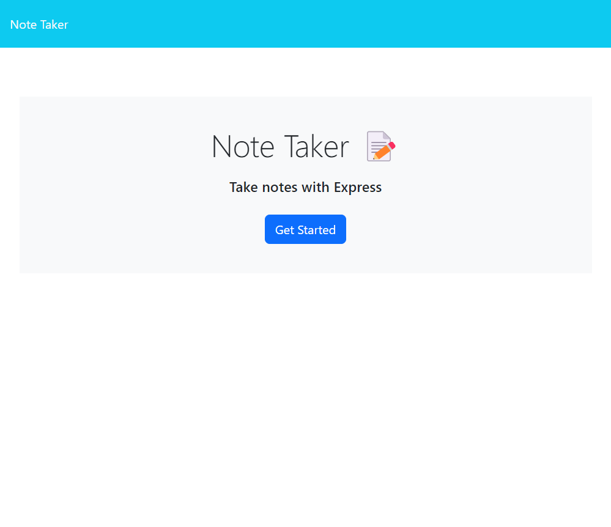
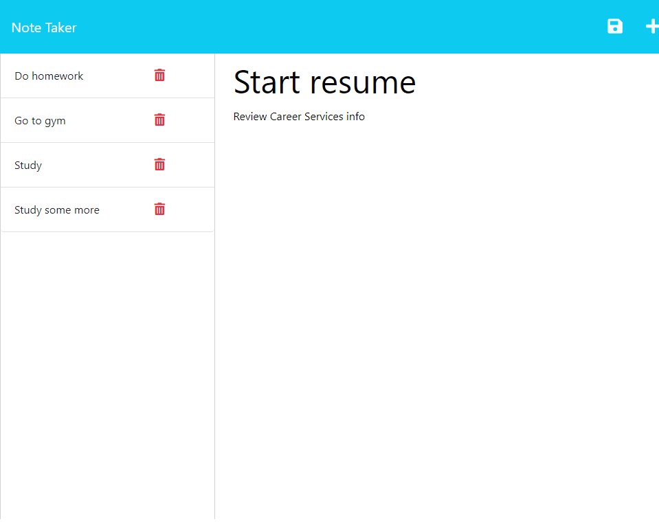

# My Notes App

## Description

This application is used to write and save notes utilizing Node.js, and Express.js.

## License

## Screenshots

## Deployed Application

https://hidden-harbor-14796.herokuapp.com/
